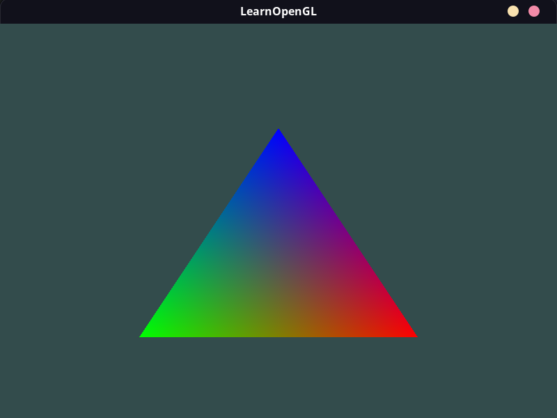
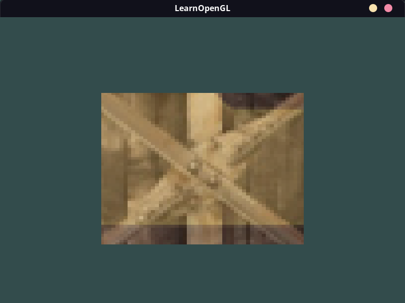
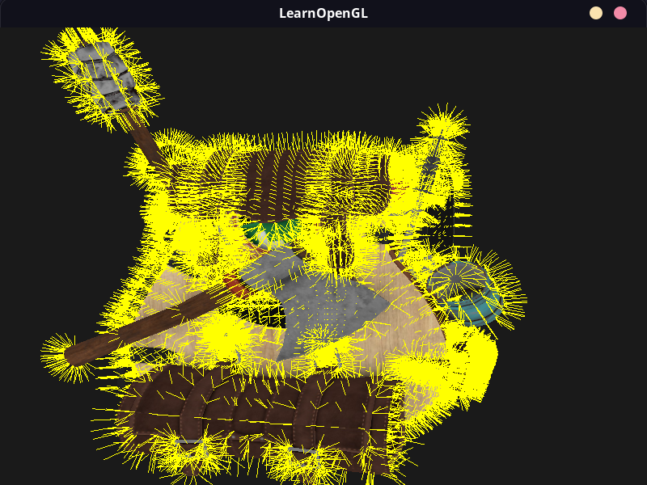

# Screenshots
At the end of each chapter and for each relevant exercise within, I took a capture of what I was drawing. I wrote [`capture.sh`](../capture.sh) to automate screenshots and manually captured video with OBS Studio.

Enjoy the journey.
---

In the beginning, there was a window. The dimensions are backwards but I press on.

---

> **Hello Triangle**

The ceremonious first-program that a graphics programmer must perform. The absolute basics are explained to put 4 vertices together and draw two triangles. My gaming GPU is sadden by how useless it feels.

---

> **Hello Triangle Exercise 1**: Try to draw 2 triangles next to each other using glDrawArrays by adding more vertices to your data

And so 2 triangles are drawn. Wireframe mode is gone.

---

> **Hello Triangle Exercise 3**: Create two shader programs where the second program uses a different fragment shader that outputs the color yellow; draw both triangles again where one outputs the color yellow

Duplicating all the existing code and changing the color bits.

---

> **Shaders**

Finally, I know what shaders are! Tiny(ish) programs that live on the GPU and, in the case of graphics programming, help process the graphics pipeline. Here, the pixels at the tips of triangle are set to RGB, respectively, by the fragment shader and the rest of the colors are automatically interpolated based on position.

---

> **Shaders Exercise 1**: Adjust the vertex shader so that the triangle is upside down.

This LearnOpenGL site is good at making small exercises to reinforce the learning.

---

> **Shaders Exercise 2**: Specify a horizontal offset via a uniform and move the triangle to the right side of the screen in the vertex shader using this offset value

Uniforms are like global variables across all shader programs and they can be set from outside the shader program.

---

> **Shaders Exercise 3**: Output the vertex position to the fragment shader using the out keyword and set the fragment's color equal to this vertex position (see how even the vertex position values are interpolated across the triangle). Once you managed to do this; try to answer the following question: why is the bottom-left side of our triangle black?

The black pixels happen because color values must be between 0.0 and 1.0. The blacks pixels all lie in the negative part of the XY plane and are clamped to 0.0, or black.

---

Instead of using straight RGB values to get color, an image can be used. This is a Texture. This is where using Go starts to show differences because I must use different libraries to load and process images than the OpenGL tutorial uses.

---

> **Shaders Exercise 1**: Make sure only the happy face looks in the other/reverse direction by changing the fragment shader.

Mr. Awesomeface can see all.

---

> **Shaders Exercise 2**: Experiment with the different texture wrapping methods by specifying texture coordinates in the range 0.0f to 2.0f instead of 0.0f to 1.0f. See if you can display 4 smiley faces on a single container image clamped at its edge.

The wood texture behaves differently based on the wrapping method.

---

> **Shaders Exercise 3**: Try to display only the center pixels of the texture image on the rectangle in such a way that the individual pixels are getting visible by changing the texture coordinates. Try to set the texture filtering method to GL_NEAREST to see the pixels more clearly.

This results in a super zoomed view.

---

> **Shaders Exercise 4**: Use a uniform variable as the mix function's third parameter to vary the amount the two textures are visible. Use the up and down arrow keys to change how much the container or the smiley face is visible.

The first video, showing off texturing mixing.

---

> **Transformations**:

By leveraging many matrix maths, the vertexes can be rotated and moved and generally transformed.

---

> **Transformations Exercise 1**: Using the last transformation on the container, try switching the order around by first rotating and then translating. See what happens and try to reason why this happens

Matrix math is not communicative a.k.a the order matters. By multiplying translation matrix last, it is effectively applied first, so the rotation does not happen around the origin anymore.

---

> **Transformations Exercise 2**: Try drawing a second container with another call to glDrawElements but place it at a different position using transformations only. Make sure this second container is placed at the top-left of the window and instead of rotating, scale it over time (using the sin function is useful here; note that using sin will cause the object to invert as soon as a negative scale is applied).

By using an ever changing value like time on transformations, movement is born.

---

> **Coordinate Systems**:

After defining the initial thing to draw once, by applying different so-called `model` matrices, we can easily draw more objects at different orientations.

---

> **Coordinate Systems Exercise 3**: Try to make every 3rd container (including the 1st) rotate over time, while leaving the other containers static using just the model matrix

---

> **Camera**

With extensive matrix maths, a fly camera is born. In this video, I have to toggle the cursor capture behavior so I can run the app then record it with OBS. WASD and the mouse are freely navigating and zooming the scene.

---

> **Camera Exercise 1**: See if you can transform the camera class in such a way that it becomes a true fps camera where you cannot fly; you can only look around while staying on the xz plane

FPS mode ready, sir!

---

> **Colors**

After a light optics lesson (pun intended) and some fragment shader tweaks, we have a light and an object being lit.

---

> **Basic Lighting**

The Phong lighting model describes three components of lighting (ambient, diffuse, and specular) that we can calculate according to a provided formula to achieve realistic shading.

---

> **Basic Lighting Exercise 1**: Right now the light source is a boring static light source that doesn't move. Try to move the light source around the scene over time using either sin or cos. Watching the lighting change over time gives you a good understanding of Phong's lighting model

Sweet! The colors of the cube react realisiticalyl to the light source.

---

> **Basic Lighting Exercise 2**:Do Phong shading in view space instead of world space

Looks similar but I wanted to show off more views, especially the shininess.
---

> **Basic Lighting Exercise 3**: Implement Gouraud shading instead of Phong shading. If you did things right the lighting should look a bit off (especially the specular highlights) with the cube object. Try to reason why it looks so weird

The interpolation of values in the fragment shader instead of direct calculation gives these worse results.

---

> **Materials**

By changing certain values in the object, the light will look different when it hits. To mimic real life materials, table exist with magic numbers for the material properties.

---

> **Materials Exercise 1** Can you make it so that changing the light color changes the color of the light's cube object?

If the light changes colors, so does the thing it lights up!

---

> **Materials Exercise 1** Can you simulate some of the real-world objects by defining their respective materials like we've seen at the start of this chapter?

Here's cyan plastic.

---

> **Lighting Maps**

If an object is made up different materials, extra textures can be specified that help, for example, calculate the appropriate light reaction on steel versus wood.

---

> **Lighting Maps Exercise 1**: Try inverting the color values of the specular map in the fragment shader so that the wood shows specular highlights and the steel borders do not (note that due to the cracks in the steel border the borders still show some specular highlight, although with less intensity)

Weird, makes it look fake.

---

> **Lighting Maps Exercise 2**: Try creating a specular map from the diffuse texture that uses actual colors instead of black and white and see that the result doesn't look too realistic.

I used the provided one that used red and yeah, looks as expected.

---

> **Lighting Maps Exercise 3**: Also add something they call an emission map which is a texture that stores emission values per fragment. Emission values are colors an object may emit as if it contains a light source itself; this way an object can glow regardless of the light conditions. Emission maps are often what you see when objects in a game glow (like eyes of a robot, or light strips on a container).

This is actually wrong! The tutorial shows a picture where the matrix text only appears on the wood, but mine goes to the edge. Probably due to the differences in how we load images.

---

> **Lighting Casters**

Different styles of lights can be approximated (with more maths, duh). The lesson discusses directional, point, and spotlight light effects.

---

> **Multiple Lights**

Throw multiple light sources into a scene, add up the contribution from each on an object, and now we're cooking with light.

---

> **Model**

This took multiple tries and I gave up several times. I didn't want to use the CGO bindings to Assimp so I had to figure out a different API on my own on loading a model. Felt pretty good when it finally worked.

---

> **Stencil Testing**

A new buffer, the stencil buffer, enters the arena. Like stencils in real life, this defines a region where things should/shouldn't be drawn. By drawing our object twice, but once with a specific type of stencil, we mimic an outline effect.

---

> **Blending**

By combining or blending two overlapping objects, we can create transparent objects. The color values from the different objects are combined.

---

> **Framebuffers**

By creating multiple framebuffers, the scene can be drawn normally once, then again on the other framebuffer with some effects, or perhaps used in a rear view window.

---

> **Framebuffers Exercise 1** : Can you use framebuffers to create a rear-view mirror? For this you'll have to draw your scene twice: one with the camera rotated 180 degrees and the other as normal. Try to create a small quad at the top of your screen to apply the mirror texture on

See your foes from behind you.

---

> **Framebuffers Exercise 2** : Play around with the kernel values and create your own interesting post-processing effects. Try searching the internet as well for other interesting kernels.

I didn't make my own interesting post-processing effects.

---

> **Cubemaps**

The cube map surrounds the scene, giving the impression of a massive environment. For style points, a model with a chrome like surface is shown, accurately reflecting the cube map.

---

> **Advanced GLSL**

Four different shaders, four different colors. This was a low-level lesson on GLSL syntax.

---

> **Geometry Shader**

We've only used the fragment and vertex shader. Now, the geometry shader is used, operating on the vertices before the vertex shader gets them.

In the first example, the geometry shader moves the vertexes some distance outward. It's constantly updated with time, giving this exploding animation.

In the second example, the normal vectors are added by the shader to the vertex list to draw. This results in small lines.

---

> **Instancing**

Instancing is a different approach that drawing, where the thing to draw is sent once to the GPU and we tell it to draw it a bunch of times. This allows a huge number of objects, like the million asteroids.

---

> **Anti-Aliasing**

To improve smooth edges, multiple samples are taken per pixel and the color of the pixel is interpolated accordingly.

---

> **Advanced Lighting**

The Phong model is improved on by using different vectors to calculate how the specular component. The new model is called Blinn-Phong and looks pretty good.

---

> **Gamma Correction**

Artists like to work in one color space and things get drawn in a different one, so for the best color results, the perceived lightness must be scaled on render.

---

> **Shadow Mapping**

This approach to shadows renders the scene, the does math to see where the light is and how that affects objects facing the light. A framebuffer is used to draw the processed shadows on to the original scene.

---

> **Point Shadows**

Different lights need different math.

---

> **Normal mapping**

Also call bump maps, these are texture files that are sampled to get the pixels depth value. This dramatically improves realism.

---

> **Parallax mapping**

Another map that improves depth, especially at oblique viewing angles.

---

> **HDR**

We've been limited to color values in the 0.0-1.0 range, but High Dynamic Range (HDR) allows a fuller expression of color by allow larger color values. This demo toggles HDR and messes with gamma correction values.

---

> **Bloom**

Bloom adds glow to light sources by calculating the bright parts of a scene, extracting the, blurring them, and drawing them again back on top of the original bright spot. This is often abused in video games.

---

> **Deferred Shading**

All the shading so far has been draw the object, then calculate all lights sources on the object to get it's final look. That gets too expensive with many light sources. The order of calculations are rearranged such that lighting calculations happen for all vertexes all at once, instead of each vertex as it goes through the graphics pipeline.

---

> **SSAO**

Ambient occlusion improves lighting by considering how light gets trapped in the little crevices of life. Screen-space ambient occlusion is an approach that uses the depth buffer to calculate occlusion (as opposed to expensive geometry) so we can get more of it for cheaper, making super realistic scenes like this one.

---

> **PBR Lighting**

Physically based rendering has a lot more input textures that are leveraged by heavy maths to mimic how a physical material actually reacts to light. It's incredibly in depth. This scene looks good but a lot more can be done.

More math, cubemaps, and HDR concepts later, PBR lighting is further improved by considering irradiance, the total amount of shiny light an area is getting from all directions, as opposed to radiance, the light from one direction. This demo has different materials for each ball to show it's reaction to 4 lights.

This involved finding and figuring a Go library that could understand HDR files.

More reflective/refractive math to consider...it pays off with realistic materials that look good in any lighting scene.

---

> **Text**

From a font file, read all the data about the font shapes and sizes, then draw that on quad. Now you got rendered text.

I spent WAY too much time thinking I had a broken implementation because the screenshot in the tutorial uses a different font than what I was using, but I thought they were the same. At least this resulted in me learning a lot more than usual (for LearnOpenGL students) about font rendering.

---

> **Breakout**

The final project was the game Breakout, from absolute scratch. I had only built games and app with the help of a game engine, so this was really cool to do. You should play it!
